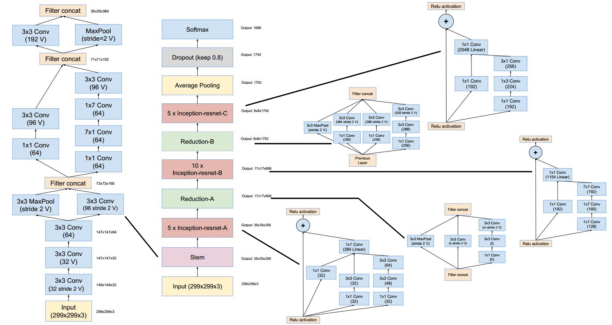

## Abstract

We have performed semantic segmentation on Dubai's Satellite Imagery Dataset by using transfer learning on an InceptionResNetV2 encoder-based UNet CNN model.
In order to artificially increase the amount of data and avoid overfitting, We preferred using data augmentation on the training set.
The model has achieved ~81% dice coefficient and ~86% accuracy on the validation set.

Dataset Link: https://www.kaggle.com/datasets/humansintheloop/semantic-segmentation-of-aerial-imagery

Model Link: https://drive.google.com/file/d/1Y5yWuJVVVFAnKjsC6z_RRxf1z955eH0D/view

## Approach

### Data Augmentation using Albumentations Library

<a href="https://albumentations.ai/">Albumentations</a>  is a Python library for fast and flexible image augmentations. Albumentations efficiently implements a rich variety of image transform operations that are optimized for performance, and does so while providing a concise, yet powerful image augmentation interface for different computer vision tasks, including object classification, segmentation, and detection.

There are only 72 images (having different resolutions) in the dataset, out of which I have used 56 images (~78%) for training set and remaining 16 images (~22%) for validation set. It is a very small amount of data, in order to artificially increase the amount of data and avoid overfitting, I preferred using data augmentation. By doing so I have increased the training data upto 9 times. So, the total number of images in the training set is 504 (56+448), and 16 (original) images in the validation set, after data augmentation.

Data augmentation is done by the following techniques:

- Random Cropping
- Horizontal Flipping
- Vertical Flipping
- Rotation
- Random Brightness & Contrast
- Contrast Limited Adaptive Histogram Equalization (CLAHE)
- Grid Distortion
- Optical Distortion

## InceptionResNetV2 Encoder based UNet Model

### InceptionResNetV2 Architecture

Source: <a href="https://arxiv.org/pdf/1602.07261v2.pdf">https://arxiv.org/pdf/1602.07261v2.pdf</a>

### UNet Architecture

Source: <a href="https://arxiv.org/pdf/1505.04597.pdf">https://arxiv.org/pdf/1505.04597.pdf</a>

### InceptionResNetV2-UNet Architecture

- InceptionResNetV2 model pre-trained on the ImageNet dataset has been used as an encoder network.

- A decoder network has been extended from the last layer of the pre-trained model, and it is concatenated to the consecutive layers.

A detailed layout of the model is available [here](./readme_images/model.png).

## References

1. C. Szegedy, S. Ioffe, V. Vanhoucke, and A. Alemi, “Inception-v4, Inception-ResNet and the Impact of Residual Connections on Learning,” arXiv.org, 23-Aug-2016. [Online]. Available: https://arxiv.org/abs/1602.07261.
2. O. Ronneberger, P. Fischer, and T. Brox, “U-Net: Convolutional Networks for Biomedical Image Segmentation,” arXiv.org, 18-May-2015. [Online]. Available: https://arxiv.org/abs/1505.04597.
